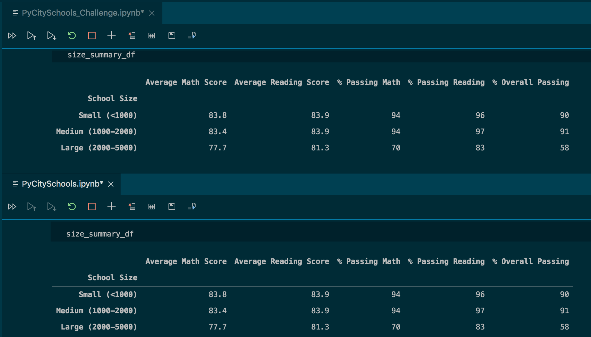

# School District Analysis
## 1. Overview
This school district analysis uses pandas and numpy python libraries, code was written on jupyter notebook to run and debug.

The project is based on two data files, school data and student data files. Analysis is done by combining the two data files into DataFrames using python pandas library. Different variations of DataFrames are used to sort and filter, and extract the original data. Due to evidence of academic dishonesty, the data for Thomas High School ninth grade records are requested to be disregarded. Therefore the analysis result is altered. Refer to the following section for more details and comparison due to the removal of Thomas High School ninth grade math and reading grades.

## 2. Results
Here is the result comparison before and after Thomas High School 9th grade records were taken off.

* District Summary has slightly changed. Since there are in total of 15 schools, and 39,170 students. Removing 9th grade Thomas High School students record has made Average Math Score in the entire district go down by 0.1 from 79.0 to 78.9. Average reading score remains the same. Passing Math goes down from 75% to 74.8%, passing reading goes down by 0.3% to 85.7% and overall passing down by 0.1% from 65% to 64.9%. Please see below the screenshot.

* School Summary contains changes for row Thomas High School only. Three column that's been affected are % Passing Math, % Passing Reading and % Overall Passing. After 9th grader records removed, the passing rate has increased by 20% to 30%.

 

* Thomas High School performance has not changed much compared to other schools. It's ranked No.2 in the top 5 school list based on the overall passing percentage. The top table is after the removing of the ninth graders' math and reading, the bottom table is prior to the change. It can be seen that Average Math Score decreased slightly while Average Reading Score incrased slightly. Passing rates have slightly decreased on the three columns.

* On the ninth-grade scores replaced, only the column for grade 9 math and reading are altered to NaN from the previous score. All other grades are not affected, please see below for an example of reading_score_by_grade table comparison. 

The scores by school spending, school size and school type has not changed due to the rounding. The removal of the 9th graders math and reading has so minor impact on the above mentioned aspect.

*Scores by School Spending*

*Scores by School Size*

*Scores by School Type*

## 3. Summary
Overall, the changes are summarized as below after reading and math scores for the ninth grade at Thomas High School has been replaced with NaNs.
* Scores by grade chart for math is affected and is showing the NaNs on the column for the **9th grade**.

* Scores by grade chart for reading is affected and is showing the NaNs on the column for the **9th grade**.

* School Summary has altered result on the passing percentages for Thomas High School.

* Thomas High School average math and reading score has changed.